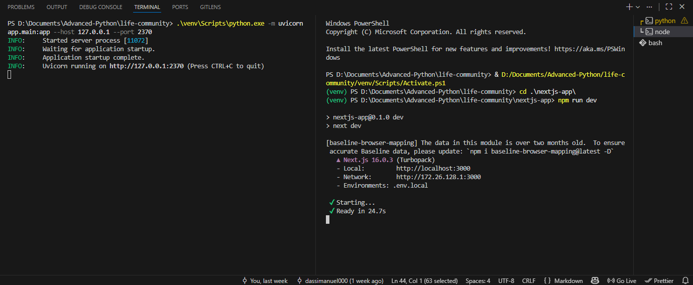

# life-community
For human

## 📦 Prerequisites

Make sure you have installed:

* Python 3.10+
* Node.js (v18+ recommended)
* npm
* Git

---

## 🔹 1. Clone the Repository

```bash
git clone https://github.com/azienda-solution/life-community.git
cd life-community
```

---

## 🔹 2. Backend Setup (FastAPI)

### Create and activate virtual environment (if not already done)

```bash
python -m venv venv
.\venv\Scripts\activate ( for windows )
```

### Install Python dependencies

```bash
pip install -r requirements.txt
```

> Make sure `python-multipart` is installed (required for file uploads).

### Run the backend server

```bash
python.exe -m uvicorn app.main:app --host 127.0.0.1 --port 2370
```

Backend will be available at:
👉 `http://127.0.0.1:2370`

---

## 🔹 3. Frontend Setup (Next.js)

Open a **second terminal**.

### Navigate to the frontend folder

```bash
cd nextjs-app
```

### Install dependencies

```bash
npm install
```

### Run the frontend

```bash
npm run dev
```

Frontend will be available at:
👉 `http://localhost:3000`

---
<p></p>

